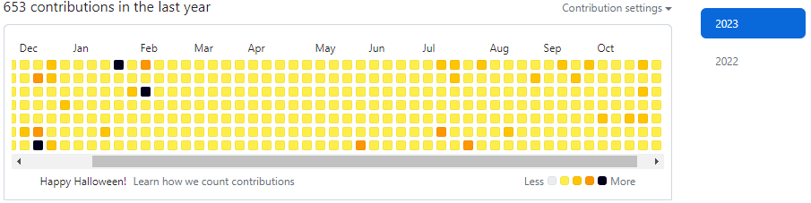

<tr>
    <td width="50%" valign="top"> 
      <h3 align="center">Codewars for Ruby#</h3>
        <!--Click the the Ranking to go to my CodewarsProfile-->
      <a target="_blank" href="https://www.codewars.com/users/KevinTap">
        
        

          
        

        <!-- 

          
        
 -->
        

          
        

      </a>
       
      
 
          
          
         
      </a> <!--Click website icon link to open a new window to My Codewars Profile changed hex color=cdf998 to 3388ff deleted lable=| and logo=wordpress-->
      
      
 
        
<strong>Daily Learning</strong> - I do a Codewars everyday in either JavaScript, Python, Ruby or C# to keep pushing myself to grow and learn. I am refreshing my C# by starting all over again with 8kyu. Once I have solved the problem myself, I study the alternate answers of best practices, most clever and interesting solutions from my fellow coders. My first answer will always be the most easy to follow. Lately I have been challenging myself to also give a one line answer on top of my version of best practices.

    </td> 
  </tr>